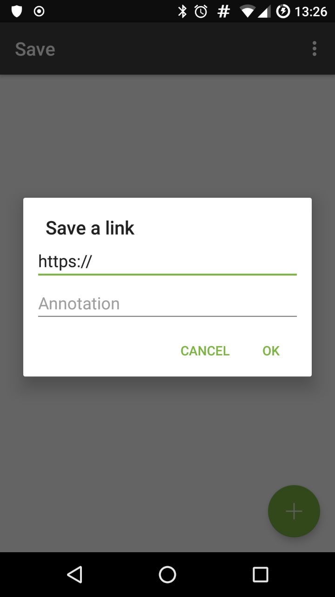
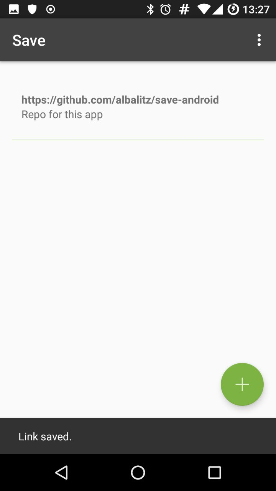
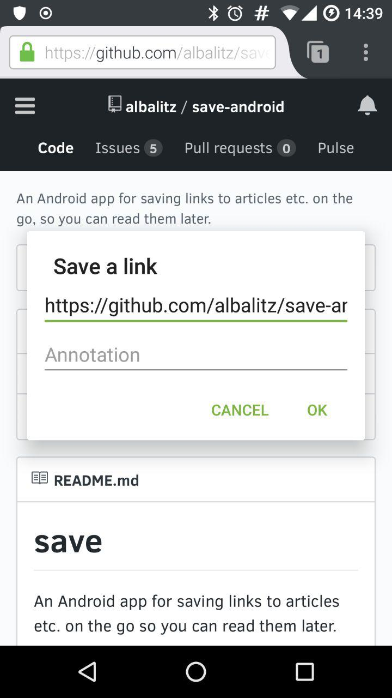

# save
An Android app for saving links to articles etc. on the go so you can read them later.

## screenshots
</a>  
Dialog for saving a link

</a>  
Saved link and confirmation

</a>  
Dialog overlay when saving a link from another app

## features
- Save from another app  
  You can select this app from another app's share screen to save links directly to this app.  
  This will also allow you to edit the link and add an annotation before saving it.
- Use local storage or api  
  In the preferences screen, you can choose to use the [api](https://github.com/albalitz/save-api).
- Choose the sort order  
  Either oldest first (default) or newest first.
- Export  
  Save your saved links to a json file on your phone's external storage.  
  Currently /sdcard/Documents/Save/save-link-export.json
- Share links to other apps  
  send your links to another app to share with friends, or save in another app
- Offline queue when saving with an api fails  
  Your links will be queued and sent to the api again later.
